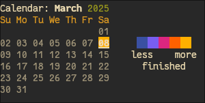

# Building and Installation 

```
cargo build -r
```
or alternatively, you could cargo install it.

# Usage

Run `cargo install` on the `cli` directory to install `tuecli`.
```
cargo install --path cli 
cd ~
```


# Flash™ Guide

Say you have a research project. We'll add the to-do's under a root pseudo-node called "College":
```
$> tuecli add -r -u college
(0) -> (root)
```

We'll use the root nodes as the base parent of other nodes. The `-u` flag makes it a pseudo-node, which doesn't count towards completion—because college will not be finished anytime soon (most likely) :)

Next, we add the rest of the tasks under the "college" node:
```
$> tuecli add "big research project" 0
(1) -> (0)

$> tuecli add "gather sample data" 1
(2) -> (1)

$> tuecli add "write report" 1
(3) -> (1)
```

So now we have something like:
```
$> tuecli ls -r
[ ] college (0)
 +--[ ] big research project (1)
 |   +--[ ] gather sample data (2)
 |   +--[ ] write report (3)
```

And we can alias the project too for quicker access:

```
$> tuecli alias 1 "bigproject"

$> tuecli ls bigproject
[ ] big research project (1:bigproject)
 +--[ ] gather sample data (2)
 +--[ ] write report (3)
```

Now, let's say we'd like to do "gather sample data" today. We can add a new date node:

```
$> tuecli add -d "today"
(4) -> (dates)
```

And link the "gather sample data" node to today's date node:
```
$> tuecli link today 2
(2) -> (4)
```

So now we can list what we have to do today:
```
$> tuecli ls today
[#] [2025-03-08] (4)
 +..[ ] gather sample data (2)
```

<small>Note: the `+..` indicates it has more than one parent, i.e the `bigproject` node.</small>

When we're done with the task, check it:
```
$> tuecli check 3
```

You can see that the current date will be highlighted in yellow now, when you open the calendar:

```
$> tuecli cal
```



After you're done with your `bigproject`, you can archive it:

```
tuecli arc bigproject
```

So now it won't appear when you `ls` nodes, unless you give the `-a` flag—which will make archived nodes appear dimmed.


# Detailed Guide


## Adding a root node

To begin, add your first root node:
```
tuecli add -r "To-do's"
```


## Adding a child node

Adding a child node to a parent nodes goes like so:

```
tuecli add <message> [parent]
```
```
tuecli add "This is a child node!" 0
```

## Displaying the tree graph 

You can list out the root nodes you've made with:

```
tuecli ls
```

or you can list out nodes recursively from the root nodes:

```
tuecli ls -r
```

Or from a specific node:

```
tuecli ls <identifier>
```

```
tuecli ls 0
```


By default, listing from the root node uses a depth of 1, including `-r` (enable recursion) to any `ls` query forces an infinite max depth listing.

## Removing Nodes

To remove a node, enter:
```
tuecli rm <identifier...>
```

```
tuecli rm 0

tuecli rm alias

tuecli rm 1 2 3
```


## Aliases

Tired of remembering node index numbers? You can alias them with:

```
tuecli alias <identifier> <alias> 
```

You can then access the node using its alias instead of index whereever:

```
tuecli alias 0 alias 
tuecli ls alias
```

## Date Nodes

Date nodes are meant to be used as day-to-day planner.

To begin, add a node for whenever you're reading this:

```
tuecli add -d 2025-01-01
```

Alternatively, relative and human-readable dates are also supported:
```
tuecli add -d today

tuecli add -d tomorrow

tuecli add -d "2 days"

tuecli add -d "next week"
```

Now, add a few tasks for today:
```
tuecli add "task one" today
tuecli add "task two" today
tuecli add "task three" today
```

and you can list its children by either writing out its index or writing the date:
```
tuecli ls "today"
```

Note that if you have a node (normal or date node) aliased as "today", it will be prioritized first. To override this behavior, specify the -D flag.

You can also label your date nodes if you want:
```
tuecli rename today "My label"
```

Or add the label when you first add the node:
```
tuecli add -d today "My label"
```

## Linking Nodes

Tuesday stores its nodes in a multigraph data structure. You can have more than one parents or children for each node.

To link node:
```
tuecli link <parent> <child>
```

And to unlink:
```
tuecli unlink <parent> <child>
```

Be careful of the arguments order, by the way. The node you want to link to other node is provided last.


## Calendar
Calendar with completion statistics is available as a complement for the date nodes feature. To open it, simply type:

```
tuecli cal
```

Which will bring up the calendar for the month you're currently in.

You can also specify any month of the year:

```
tuecli cal February
```

Or a specific date. Note that only its month will be considered:
```
tuecli cal 2025-02-01
```

Due to limitations, date expressions like "Feb 2025" are not supported yet. We plan to add this in the future, or you can also contribute to the codebase :)

# Raffling Node
Overwhelmed and don't know what to do at the moment? We've all been there, so that's why we created node raffles!

```
tuecli rand <parent id>
```

This will select a random child from the parent node.

If you only want to select unchecked nodes:
```
tuecli rand <parent id> -u
```

Or, for some reason, only checked nodes:
```
tuecli rand <parent id> -c
```

# Archiving Nodes

Archiving a node will hide it when listed (by default).

```
tuecli arc <identifier>
```

Unarchive it:
```
tuecli unarc <identifier>
```

When you want to view archived nodes, pass the `-a` flag to the `ls` subcommand:
```
tuecli ls [parent] -a
```

List all archived nodes:
```
tuecli lsa
```

Archived nodes will have their messages dimmed.


## Cleaning Nodes
Because of how Tuesday save files work, unused indices will not be reclaimed unless you clean them. If your node indices are getting big, you can run:
```
tuecli clean
```

# More Usage Help

Refer to the help message when you type `tuecli --help` for full usage guide.
