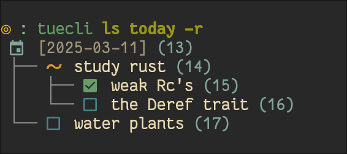

# Tuecli

CLI front-end for Tuesday.

# Usage
Refer to [Usage Guide](doc/usage-guide.md).

# Configuration
Configuration for the screenshots above: [DaringCuteSeal's configuration](https://gist.github.com/DaringCuteSeal/dd5d56b607cefa5cf8930858aa76f794).

Run `tuecli dump-cfg` to generate a default configuration. You can save it to `~/.tueconf.toml` for permanent configuration. All the configuration keys are explained well enough in the configuration.

List of supported colors (that can be written directly e.g as "red", "blue", etc):
- red
- cyan
- blue
- green
- orange
- yellow
- purple
- magenta
- grey
- darkgrey
- white

Otherwise, write your color as a 6-digit hex color code (without the leading hashtag!)
